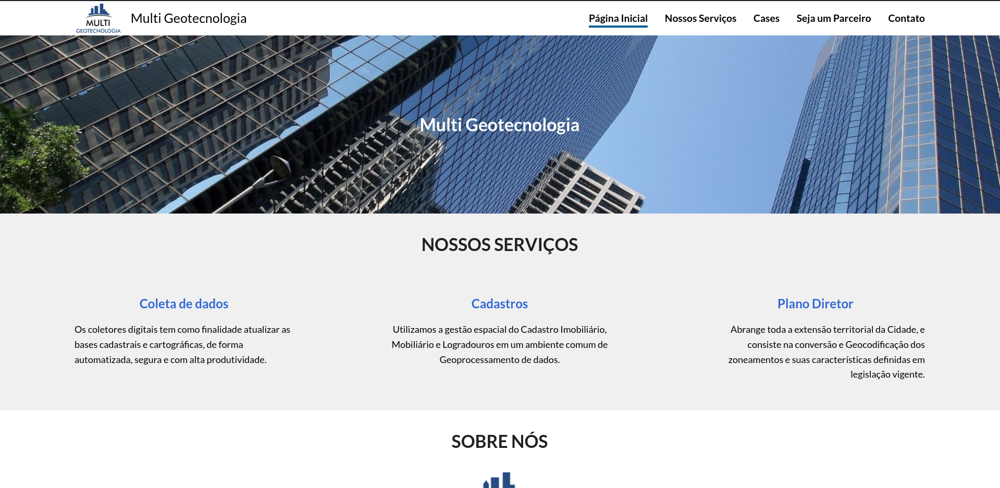

<h1 align="center">Multi-Tecnologia</h1>

> Status do Projeto: Concluído :heavy_check_mark:
## Descrição do Projeto

Recriação de um site já existente ([link](https://www.multigeotecnologia.com/p%C3%A1gina-inicial)), aplicando melhorias tanto na interface quando no código. Consiste em uma Single-Page-Application com páginas responsivas e desenvolvimento de um formulário funcional com persistência de dados em banco MySQL.



### :hammer: Funcionalidades

- Indicador de página atual no cabeçalho;
- Menu-hambúrguer responsivo;
- Formulário de contato com validação completa e personalizada;
- Persistência dos dados enviados no formulário em banco de dados;
- Resposta personalizada de sucesso ou falha no envio do formulário;

## :books: Frameworks, Libs e Dependências Utilizadas

- [Express](https://expressjs.com/pt-br/)
- [Nodemon](https://nodemon.io/)
- [Prisma](https://www.prisma.io/)
- [mysql2](https://www.npmjs.com/package/mysql2)
- [CORS](https://developer.mozilla.org/pt-BR/docs/Web/HTTP/CORS)
- [React](https://pt-br.reactjs.org/)
- [Vite](https://vitejs.dev/)
- [React Router DOM](https://www.npmjs.com/package/react-router-dom)
- [Axios](https://axios-http.com/ptbr/docs/intro)
- [phosphor-react](https://www.npmjs.com/package/phosphor-react)

## 📁 Acesso ao Projeto

Para executar o projeto na sua máquina você precisa ter instalado o [Node.js](https://nodejs.org/en/).

### Como executar
Após [baixar]() ou clonar (necessita ter o git instalado) este repositório :
- Localize e navegue até a pasta do projeto no terminal (caso tenha sido baixado é necessário extraí-lo);
- No terminal execute os comandos: 

``` bash
# Navegue para a pasta do front-end
$ cd frontend

# Instale as dependências
$ npm install

# Inicie o servidor do Vite
$ npm run dev
```

- Abra uma nova aba ou janela do terminal e, na pasta do projeto, execute os comandos:

``` bash
# Navegue para a pasta do back-end
$ cd backend

# Instale as dependências
$ npm install

# Inicie o servidor do back-end
$ npm run dev
```

- Acesse o endereço http://localhost:3000 para acessar o site;

*Obs: Para que os dados enviados pelo formulário persistam em algum banco de dados, e o sistema funcione corretamente, crie um arquivo .env com base no .env.example existente, informando a url do seu banco de dados MySQL. [Link de suporte](https://www.prisma.io/docs/concepts/components/prisma-schema/data-sources)*